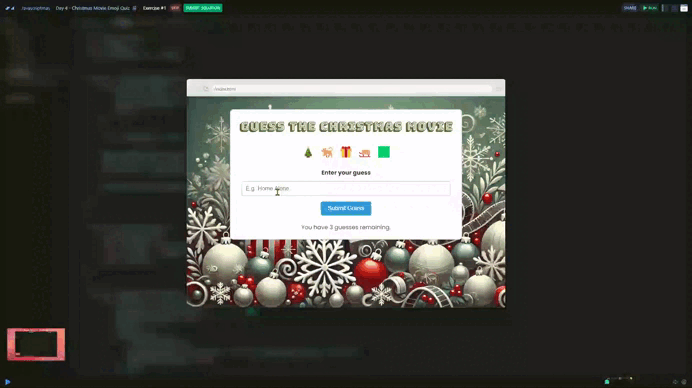
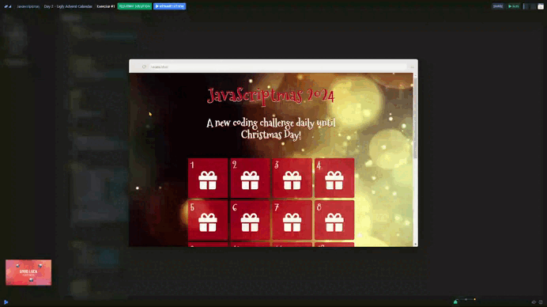

# Javascriptmas 2024 🎄

Javascriptmas is a festive coding event created by [**Scrimba**](https://scrimba.com/home), running from December 1st to December 24th. Every day, a new *"door"* unlocks, revealing an exciting JavaScript challenge to solve.

## Day 04 - Christmas Movie Emoji Quiz 🎬

| [Scrim code](https://scrimba.com/exercise-s0n6uk9l97) | [Challenge](./day-04/README.md) |
| --- | --- |

## Day 03 - Santa's Emoji Hack 👍

| [Scrim code](https://scrimba.com/exercise-s09c00q7fj) | [Challenge](./day-03/README.md) |
| --- | --- |

## Day 02 - Ugly Advent Calendar 🗓️

| [Scrim code](https://scrimba.com/exercise-s0q8lt2e6r) | [Challenge](./day-02/README.md) |
| --- | --- |

## Day 01 - Grandpa's Gift List 🎅

| [Scrim code](https://scrimba.com/exercise-s0g1bb2ue0) | [Challenge](./day-01/README.md) |
| --- | --- |

