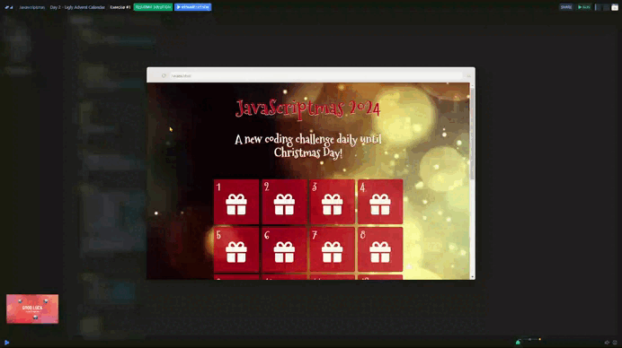

# Day 02 - Ugly Advent Calendar 🗓️

## Challenge

Improve the user experience of an advent calendar. The current design is basic and lacks functionality, so the goal is to make it more interactive and visually appealing.

### Stretch goals:

1. Make the calendar more interactive; clicking each day could *"open"* that day.

1. Every day that is open display a random Christmas gift (or chocolate?) in the box.

1. Save the state of the calendar in LocalStorage.

## Solution

[Scrim code](https://scrimba.com/exercise-s0q8lt2e6r) 👈

***
[🔙 Javascriptmas 2024](../README.md)

