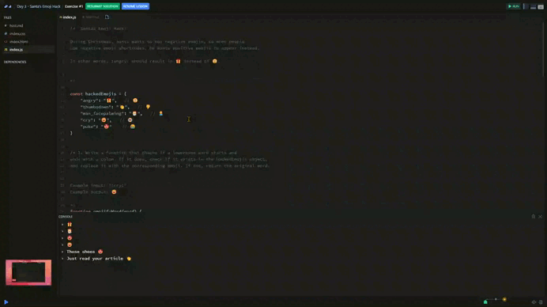

# Day 03 - Santa's Emoji Hack 👍

## Challenge

Santas Emoji Hack!

During Christmas, Santa wants to ban negative emojis, so when people
use negative emoji shortcodes, he wants positive emojis to appear instead.

In other words, :angry: should result in 🎁 instead of 😠.

1. Write a function that checks if a lowercase word starts and 
ends with a colon. If it does, check if it exists in the hackedEmojis object, and replace it with the corresponding emoji. If not, return the original word.

    + Example input: ":cry:"  
    + Example output: ‍😄

2. Write a function to find any emoji shortcodes in a phrase.
Use your emojify function from the previous exercise!

    + Example input: "Just read your article :thumbsdown:"
    + Example output: "Just read your article 👏"


### Stretch goals:

Don't just replace the shortcodes, but also any emojis are added directly to the text.


## Solution

[Scrim code](https://scrimba.com/exercise-s09c00q7fj) 👈



```js
function emojifyWord(word) {

    if (word.startsWith(":") && word.endsWith(":")) {
        const emojiKey = word.slice(1, -1)

        if (emojiKey in hackedEmojis) {
            return hackedEmojis[emojiKey]
        }
    }

    return word
}
```

```js
function emojifyPhrase(phrase) {
    const wordArr = phrase.split(" ")

    const modifiedPhrase = wordArr.map(word => {
        return emojifyWord(word)
    }).join(" ")

    return modifiedPhrase
}
```

### Resources

📚 [startsWith()](https://developer.mozilla.org/en-US/docs/Web/JavaScript/Reference/Global_Objects/String/startsWith) by MDN

📚 [in](https://developer.mozilla.org/en-US/docs/Web/JavaScript/Reference/Operators/in) by MDN

📚 [split()](https://developer.mozilla.org/en-US/docs/Web/JavaScript/Reference/Global_Objects/String/split) by MDN


***
[🔙 Javascriptmas 2024](../README.md)

