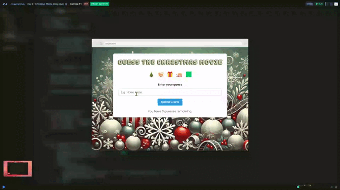

# Day 04 - Christmas Movie Emoji Quiz 🎬

## *Challenge* 💪
You are going to build an app that challenges players to identify a Christmas Movie from some emoji 🍿 🎅 🎬. The players will have 3 guesses per movie.

For example, the emoji 🌇 💣 👮 ✈️ ️🔫  represent the film “Die Hard”, which everyone knows is the best Christmas movie of all time.

In data.js you have an array of Christmas movies with emoji and text for aria labels.

Your task is to build an app that meets these criteria:

- The app should present the player with a set of emoji selected at random from the array in data.js. 

- The player will input their guess.

- If the player guesses correctly, the app should display a message saying "Correct!". Then, after a pause of 3 seconds, it should randomly select the next set of emoji clues and display them to the player.

- If the player’s guess is incorrect, the app should display a message saying “Incorrect! You have 2 more guesses remaining.”

- If the player fails to guess correctly on the next two attempts, the app should display a message saying, `The film was <Film Name Here>!`. After a pause of 3 seconds, it should randomly select a new set of emoji clues and display them to the player.

- When all films in the array have been used, the player should see a message saying "That's all folks!".

- Each film should only be used once. There should be no repetition. 


### *Stretch Goals*

- Use AI to decide if an answer is correct or incorrect. For example if the correct answer is "The Polar Express" but the player inputs "Polar Express" a straight comparison of the two strings will find that the player's answer was incorrect. AI could assess if there is sufficient similarity between the strings to judge it as correct. 

- Improve the UX by disabling the form/button when the game is over and during the pause between questions.

## *Solution* 🤔

[Scrim code](https://scrimba.com/exercise-s0n6uk9l97) 👈



```js
const guessForm = document.getElementById('guess-form')
const messageContainer = document.getElementById('message-container')
const emojiCluesContainer = document.getElementById('emoji-clues-container')
const submitBtn = document.querySelector('button')


let currentTitle = ''
let attempts = 3
const copyFilms = [...films]


function renderRandomEmoji() {
    if (copyFilms.length === 0) {
        emojiCluesContainer.textContent = `That's all folks!`
        guessForm.disabled = true
        return
    }

    const randomIndex = Math.floor(Math.random() * copyFilms.length)

    emojiCluesContainer.textContent = copyFilms[randomIndex].emoji.join(" ")
    emojiCluesContainer.setAttribute('ariaLabel', `${copyFilms[randomIndex].ariaLabel}`)
    currentTitle = copyFilms[randomIndex].title.toLowerCase()

    copyFilms.splice(randomIndex, 1)
}


function getUserGuess(e) {
    e.preventDefault()
    const formData = new FormData(guessForm)
    const userGuess = formData.get("guess-input").trim().replace(/\s+/g, " ").toLowerCase()
    return userGuess
}


function comparison(filmTitle, userGuess) {
    if (filmTitle === userGuess) {
        messageContainer.textContent = `Correct! ✅`
        submitBtn.disabled = true
        attempts = 3
        setTimeout(() => {
            renderRandomEmoji()
            messageContainer.textContent = `You have ${attempts} guesses remaining.`
            submitBtn.disabled = false
        }, 3000)
        guessForm.reset()
    } else {
        attempts--
        messageContainer.textContent = `Incorrect! ❌`
        submitBtn.disabled = true

        setTimeout(() => {
            if (attempts > 0) {
                messageContainer.textContent = `You have ${attempts} guesses remaining.`
                submitBtn.disabled = false
            } else {
                attempts = 3
                messageContainer.textContent = `The film was ${currentTitle.toUpperCase()}!`
                setTimeout(() => {
                    renderRandomEmoji()
                    messageContainer.textContent = `You have ${attempts} guesses remaining.`
                    submitBtn.disabled = false
                }, 3000)
            }
        }, 1500)

        guessForm.reset()
    }
}


document.addEventListener("DOMContentLoaded", () => {
    renderRandomEmoji()
})


guessForm.addEventListener("submit", (e) => {
    const userGuess = getUserGuess(e)
    comparison(currentTitle, userGuess)
})
```


***
[🔙 Javascriptmas 2024](../README.md)