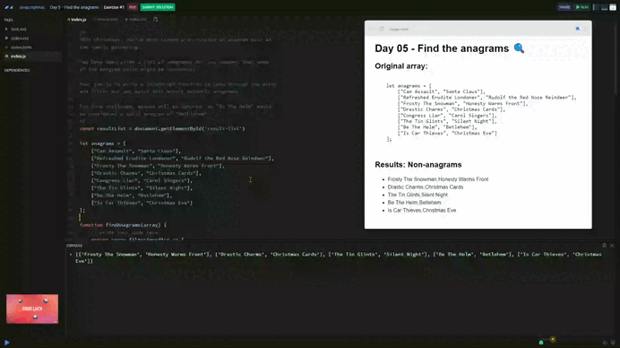

# Day 05 - Find the anagrams 🔍

## *Challenge* 💪

This Christmas, you’ve been tasked with running an anagram quiz at 
the family gathering.

You have been given a list of anagrams, but you suspect that some 
of the anagram pairs might be incorrect.

Your job is to write a JavaScript function to loop through the array
and filter out any pairs that aren’t actually anagrams.

For this challenge, spaces will be ignored, so "Be The Helm" would 
be considered a valid anagram of "Bethlehem".

```js
let anagrams = [
    ["Can Assault", "Santa Claus"],
    ["Refreshed Erudite Londoner", "Rudolf the Red Nose Reindeer"],
    ["Frosty The Snowman", "Honesty Warms Front"],
    ["Drastic Charms", "Christmas Cards"],
    ["Congress Liar", "Carol Singers"],
    ["The Tin Glints", "Silent Night"],
    ["Be The Helm", "Betlehem"],
    ["Is Car Thieves", "Christmas Eve"]
];
```

## *Solution* 🤔

[Scrim code](https://scrimba.com/exercise-s0trb56kgt) 👈



```js
function findAnagrams(array) {
  return array.filter(wordArr => { 
    
    // Map each word in the pair to normalize and sort its letters.
    const normaliseAndSortWords = wordArr.map(word => 
      word
        .toLowerCase()          // Convert the word to lowercase to ignore case differences.
        .replace(/\s+/g, '')    // Remove any whitespace.
        .split('')              // Split the word into an array of characters.
        .sort()                 // Sort the characters alphabetically.
        .join('')               // Join the characters back into a string.
    );
    // Check if the normalized and sorted words are different.
    // If they are different, the pair is not an anagram.
    return normaliseAndSortWords[0] !== normaliseAndSortWords[1];
  });
}

const invalidAnagramas = findAnagrams(anagrams)
```

### Pseudocode

Pseudocode:

1. Normalise the words:
    + convert all words in each pair to lowercase,
    + remove spaces,
    + sort the letters in each word alphabetically
2. Compare the words:
    + check if the normalised words in a pair are equal,
    + if they aren't equal, keep the pair
3. Filter:
    + return only the pair that aren't equal

### Regex explanation

+ `\s`: Matches any whitespace character (spaces, tabs, newlines)

+ `+`: Matches one or more of the preceding character (multiple space)

+ `g`: Ensures the pattern is applied globally to anll matches in the text.

***
[🔙 Javascriptmas 2024](../README.md)