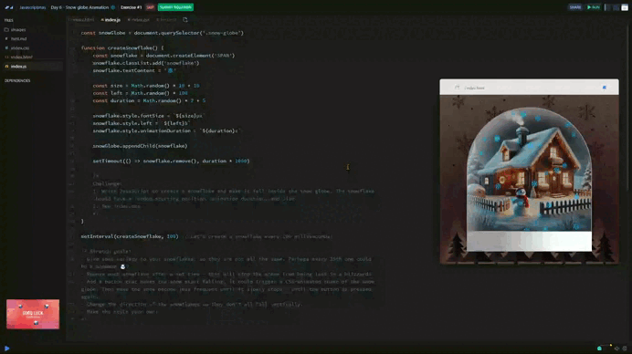

# Day 06 - Snow globe animation ❄️

## *Challenge* 💪

1. Write JavaScript to create a snowflake and make it fall inside the snow globe. The snowflake should have a random starting position, animation duration, and size.
2. See index.css

### *Stretch goals*
- Give some variety to your snowflakes, so they are not all the same. Perhaps every 25th one could be a snowman ☃️?
- Remove each snowflake after a set time - this will stop the scene from being lost in a blizzard!
- Add a button that makes the snow start falling, it could trigger a CSS-animated shake of the snow globe. Then make the snow become less frequent until it slowly stops - until the button is pressed again.  
- Change the direction of the snowflakes so they don’t all fall vertically.
- Make the style your own! 

## *Solution* 🤔

[Scrim code](https://scrimba.com/exercise-s07afce4i6) 👈



```css
.snowflake {
  position: absolute;
  top: -10px;
  user-select: none;
  pointer-events: none;
  animation: fall linear infinite;
  z-index: 4;
  left: 50%; /* Posición base */
  transform: translateX(-50%);
}

@keyframes fall {
  to {
    transform: translateY(100vh) translateX(calc(var(--drift, 0) * 100%));
  }
}
```

```js
// Initialize a flag to track if snow is currently falling
let isSnowing = false

// Create a toggle button to start or stop the snow
const toggleButton = document.createElement('button')
toggleButton.textContent = 'Start Snow' // Initial button text
document.body.appendChild(toggleButton) // Add the button to the body

let intervalId // Variable to store the interval ID for snowflake creation

// Add an event listener to toggle the snow effect
toggleButton.addEventListener('click', () => {
    if (isSnowing) {
        // If snowing, stop creating snowflakes and update the button text
        clearInterval(intervalId)
        toggleButton.textContent = 'Start Snow'
    } else {
        // If not snowing, start creating snowflakes and update the button text
        intervalId = setInterval(createSnowflake, 100) // Create snowflakes every 100ms
        toggleButton.textContent = 'Stop Snow'
    }
    isSnowing = !isSnowing // Toggle the snowing state
})

let snowflakeCount = 0 // Counter to track the number of snowflakes created

// Function to create a snowflake
function createSnowflake() {
    snowflakeCount++ // Increment the snowflake counter

    // Create a new div element for the snowflake or snowman
    const snowflake = document.createElement('div')
    snowflake.classList.add('snowflake') // Add the snowflake CSS class
    snowflake.textContent = snowflakeCount % 25 === 0 ? '☃️' : '❄️' // Snowman every 25th snowflake

    // Generate random properties for the snowflake
    const size = Math.random() * 10 + 10 // Random size between 10px and 20px
    const position = Math.random() * snowGlobe.offsetWidth // Random horizontal position within the snow globe
    const duration = Math.random() * 5 + 2 // Random animation duration between 2s and 7s
    const drift = Math.random() * 0.5 - 0.25 // Random horizontal drift (-0.25 to 0.25)

    // Apply the random properties to the snowflake
    snowflake.style.fontSize = `${size}px` // Set font size
    snowflake.style.left = `${position}px` // Set horizontal position
    snowflake.style.animationDuration = `${duration}s` // Set animation duration
    snowflake.style.setProperty('--drift', drift) // Set custom drift property for CSS

    // Append the snowflake to the snow globe
    snowGlobe.appendChild(snowflake)

    // Remove the snowflake after its animation ends
    setTimeout(() => {
        snowflake.remove()
    }, duration * 1000) // Remove after `duration` milliseconds
}
```

### *Explanation*

1. Toggle Button Functionality:
    + A button allows the user to start or stop the snowfall effect.
    + It uses a setInterval to continuously call createSnowflake() every 100 milliseconds when snowing starts.
    + When the snow stops, clearInterval() halts snowflake creation, and the button text updates accordingly.

1. Snowflake Creation:
    + Each snowflake is represented by a <div> with the class snowflake.
    + Every 25th snowflake is replaced by a snowman emoji (☃️) for variety.
    + Random properties are applied:
      + Size: Between 10px and 20px for visual variety.
      + Position: Based on the width of the snow globe to ensure they fall inside it.
      + Duration: Animation lasts between 2 to 7 seconds for natural variation.
      + Drift: Adds a slight horizontal movement to simulate realistic falling snow.

1. Dynamic Removal:
    + Snowflakes are removed from the DOM using setTimeout() after their animation ends to prevent a buildup of unnecessary elements.

1. CSS Integration:
    + The --drift custom property is used in CSS to control the horizontal drifting animation of each snowflake.

1. Performance Optimization:
    + By removing snowflakes after their animation, the DOM stays clean and the application runs smoothly even during extended snow periods.


***
[🔙 Javascriptmas 2024](../README.md)