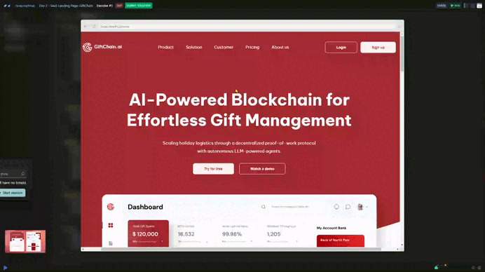

# Day 07 - SaaS Landing Page: GiftChain 🪙

## Challenge

Your task is to transform this complete landing page design into clean and well-structured HTML and CSS. As you can see, the skeleton of the HTML has already been provided. You are free to modify it if necessary. Additionally, a small portion of CSS is included, covering some of the colors used in the design and minimal styling to size the images and add a background color to the navbar for logo visibility.

Your challenge is to refine and build upon this foundation to create a polished, responsive, and visually appealing landing page.

## Solution

[Scrim code](https://scrimba.com/exercise-s0og448iuq) 👈

---
[🔙 Javascriptmas 2024](../README.md)