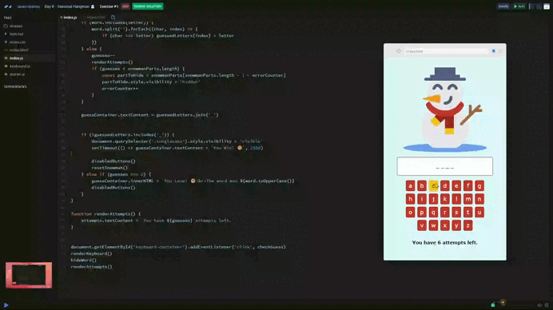

# Day 08 - Seasonal Hangman ☃️

## Challenge

1. Your challenge is to build a Christmas take on the classic game "Hangman" where a player attempts to guess a word by selecting letters to save a snowman from melting.
- The snowman is made up of 6 parts: hat, arm, nose, scarf, head, and body. These are separate images and have been positioned with CSS.
- At the start of the game, a player can see a number of dashes, with a dash for each letter of the word. So if the word was TREE the player would see - - - -
- The player selects a letter. 
- If that letter is in the word, that letter replaces the dash in the corresponding position. For the word "TREE", if the player has selected the letter E, they will see --EE.
- If the selected letter does not appear in the word, one part of the snowman gets removed.
- If the player guesses the entire word, they win! 
    - any removed parts of the snowman are reinstated.
    - the snowman gets sunglasses
    - the message "You Win!" is displayed in the "guess-container" div.
-If the player guesses wrong 6 times: 
    - only a puddle remains.
    - the message "You Lose!" is displayed in the "guess-container" div.
    
***Stretch Goals***

- Disable the letter button once a letter has been used.
- Add a "New Game" button that appears at the end of a game and resets the app. (You will need to create an array of words to guess)

## Solution

[Scrim code](https://scrimba.com/exercise-s0thpnk414) 👈

---
[🔙 Javascriptmas 2024](../README.md)