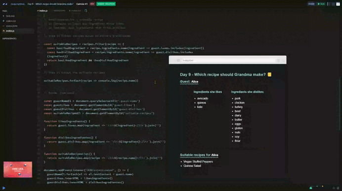

# Day 09 - Which recipe should Grandma make? 🤔

## Requirements for a suitable recipe
1. Contains at least one ingredient Alice likes
2. Contains zero ingredients that Alice dislikes

+ Step 1: Filter recipes based on Alice's preferences
+ Step 2: Output the suitable recipes

## Solution

[Scrim code](https://scrimba.com/exercise-s0dir42tib) 👈



```js
// Step 1: Filter recipes based on Alice's preferences
const suitableRecipes = recipes.filter(recipe => {
  const hasLikedIngredient = recipe.ingredients.some(ingredient => guest.loves.includes(ingredient))
  const hasDislikedIngredient = recipe.ingredients.some(ingredient => guest.dislikes.includes(ingredient))
  return hasLikedIngredient && !hasDislikedIngredient
})

// Step 2: Output the suitable recipes
suitableRecipes.forEach(recipe => console.log(recipe.name))
```

### Pseudocode

1. Initialize a list to store suitable recipes:
    + Create the constant `suitableRecipes` to store the filtered recipes.

1. Filter recipes using `filter`:
    + Iterate over each recipe in the `recipes` array.
    + For each recipe, evaluate the following conditions:

1. Check if the recipe contains ingredients the guest loves:
    + Use the `some` method on `recipe.ingredients` to check if at least one ingredient is present in the `guest.loves` array.

1. Check if the recipe contains ingredients the guest dislikes:
    + Use the `some` method on `recipe.ingredients` to check if at least one ingredient is present in the `guest.dislikes` array.

1. Decide whether to include the recipe in the suitable recipes list:
    + Add the recipe to `suitableRecipes` if:
      + It contains at least one ingredient the guest loves (`hasLikedIngredient`).
      + It does not contain any ingredients the guest dislikes (`!hasDislikedIngredient`).

1. Print the suitable recipes:
    + Display the message "Suitable recipes for Alice:" in the console.
    + Iterate over the recipes in `suitableRecipes` using forEach.
    + For each recipe, print its `name` property.

***
[🔙 Javascriptmas 2024](../README.md)

