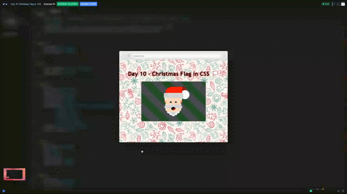

# Day 10 - Christmas Flag in CSS 🏳️

## Challenge
+  Implement Mrs. Claus' Christmas flag design and do it from the scratch.
+ The flag design should be 360px by 225px

***Stretch goals***
+ Draw Mrs. Claus's face besides Santa's face on the flag


## Solution

[Scrim code](https://scrimba.com/exercise-s0l3i5snpr) 👈



## What I learnt
```css
background: repeating-linear-gradient(45deg,
    #1F4C27 0%,
    #1F4C27 9.4%,
    #4C4D51 9.4%,
    #4C4D51 18.8%);
```

1. `repeating-linear-gradient`
    + This is a type of gradient that repeats a pattern across the background area.
    + Unlike linear-gradient, it repeats the defined pattern automatically when it reaches the end of the first sequence.

1. `45deg`
    + 45deg means that the gradient starts from the upper left corner and extends towards the lower right corner.

1. Colours and Positions
    ```css
    #1F4C27 0%, 
    #1F4C27 9.4%, 
    #4C4D51 9.4%, 
    #4C4D51 18.8%
    ```
    + *This means:*
      + #1F4C27 (dark green): starts at 0% and extends to 9.4%.
      + #4C4D51 (dark grey): starts at 9.4% and extends to 18.8%.

1. Repeated Pattern
    + Once this colour block (18.8% in length) is defined, the gradient repeats it continuously in the same direction.


***
[🔙 Javascriptmas 2024](../README.md)