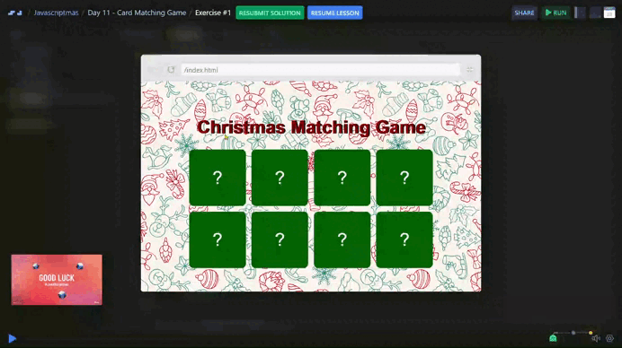

# Day 11 - Card Matching Game 🃏

## Challenge

***Requirements***:
- This is a classic "Find the Pair" game with a christmas theme.
- The player should be able to reveal cards by clicking on them.
- When the player reveals one card, it should stay revealed until a second card is revealed.
- When the player reveals two cards:
  - If they are the same, they should remain revealed for the rest of the game.
  - If they are different, they should be flipped back to hidden.
- The cards should be shuffled at the start of each game.

***Stretch Goals***:
- Add a point system where points are awarded for each correctly revealed pair 
- and deducted for each incorrect pair (you decide the exact points for each action).
- Implement a high-score system using the browser's local storage.
- Add a "Restart Game" button that appears when the game ends so the user can start over.

## Solution

| [Scrim code](https://scrimba.com/exercise-s0qks5vetm) |
| --- |



```js
function shuffleArray(array) {
  for (let i = array.length - 1; i > 0; i--) {
    const randomIndex = Math.floor(Math.random() * (i + 1));
    [array[i], array[randomIndex]] = [array[randomIndex], array[i]]; // Swap elements
  }
  return array;
}
```

***Explanation:***

1. What it does:  
  It rearranges the items in the array into a random order. For example:
    ```js
    const arr = [1, 2, 3, 4];
    console.log(shuffleArray(arr)); // Could output [3, 1, 4, 2] or any random order
    ```
1. How it works:  
    + Start from the last element of the array and work backward.
    + For each element, pick a random position in the array.
    + Swap the current element with the randomly picked one.

1. Why it works:  
  Each element has an equal chance of being placed in any position, so the array gets shuffled properly.


---
[🔙 Javascriptmas 2024](../README.md)