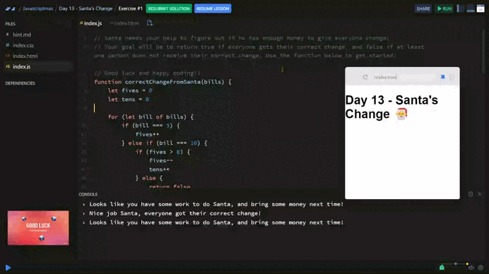

# Day 13 - Santa's Change 👛

## Challenge

Santa has decided to start charging $5 per person for his yearly delivery service.

Santa needs your help to figure out if he has enough money to give everyone change!

### *Some things to keep in mind!*

+ Santa will only accept $5, $10 and $20 bills.
+ You cannot split a bill in half, for example if someone pays with a $10 and you only have a $10. You will take their $10 and they will not get any change!
+ Your goal will be to return a boolean. You should return `true` if everyone received their correct change, or `false` if at least one person did not.


## Solution

| [Scrim code](https://scrimba.com/exercise-s04sobeltg) |
| --- |



```js
function correctChangeFromSanta(bills) {
  let fives = 0
  let tens = 0

  for (let bill of bills) {
    if (bill === 5) {
      fives++
    } else if (bill === 10) {
        if (fives > 0) {
            fives--
            tens++
        } else {
            return false
        }
    } else if (bill === 20) {
        if (tens > 0 && fives > 0) {
            tens--
            fives--
        } else if (fives >= 3) {
            fives -= 3
        } else {
            return false
        }
    }
  }

  return true
}
```

### *Explanation*:

1. **Strategy**: The code uses two variables, `fives` and `tens`, to count how many 5 and 10 dollar bills Santa has. Then, for each bill in the `bills` array, Santa checks if he has enough money to give the correct change:
    + If he receives a 5 dollar bill, he keeps it.
    + If he receives a 10 dollar bill, he needs a 5 dollar bill to give change.
    + If he receives a 20 dollar bill, he needs to give change with a combination of 5 and 10 dollar bills.

1. **Result**: If at any point Santa cannot give the correct change, the function returns `false`. If he can give change throughout the whole process, it returns `true`.


---
[🔙 Javascriptmas 2024](../README.md)