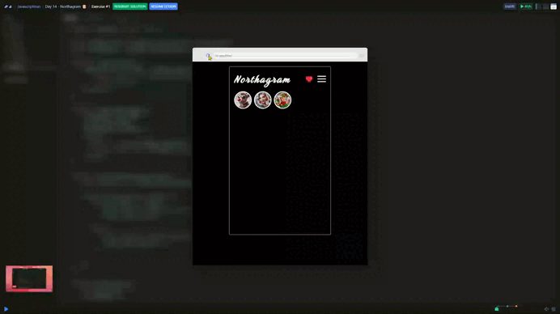

# Day 14 - Northagram 🎅

## Challenge

The cool people of Lapland are bored of traditional social media and have decided to build their own app called Northagram...and they need your help!

This is how the app should work:
- It displays circular avatars of the friends who have uploaded pictures lately. These avatars have a white border.
- Underneath, it cycles through the friends' pictures displaying each for 1.5 seconds. (There's an animated snowman loading state before pictures load.)
- While a friend's pictures are being displayed, that friend's avatar gets a red border.
- This red border reverts to white when their pictures have finished being displayed.
- When all of the images have been displayed, the user should see a message "Refresh to load latest images". All avatars should have a white border at this point.

***Stretch Goals*** for dedicated Social Media Engineers

- Add captions to the images.
- Refactor your code to use generators!
- Grey out the avatar after that friend's pictures have been displayed.
- Make it so clicking on an image pauses the timer.
- Add left and right arrow overlays to the image so users can scroll back and forth.

## Solution

| [Scrim code](https://scrimba.com/exercise-s0qv7uhgdt) |
| --- |

### ***Step by step***

1. **Import data**: Data is imported from the `data.js` file. This data contains information about avatars and their associated images.

1. **Select DOM elements**: Two elements in the HTML are selected:
    + `.feed-avatars`: where avatars will be displayed.
    + `.feed-images`: where the featured image will be displayed.

1. **Render avatars**: The `renderAvatars` function creates images for each avatar based on the data and inserts them into the `.feed-avatars` container.

1. **Render featured image**: The `renderImage` function clears the image container and displays a new image along with a descriptive text.

1. **Highlight an avatar**: The `renderHighlight` function adjusts the classes and opacity of the avatars to highlight the currently active one.

1. **Control the flow with a timer**:
    + The `handleTimer` function alternates between each avatar's images and moves to the next avatar when its images are done.
    + Once all avatars have been displayed, it stops the process and shows a message.
1. **Program initialization**: The `renderAvatars` and `handleTimer` functions are executed to start the behavior.

This code creates an interactive gallery that automatically switches between avatars and their featured images, displaying a message when the sequence ends.

---
[🔙 Javascriptmas 2024](../README.md)