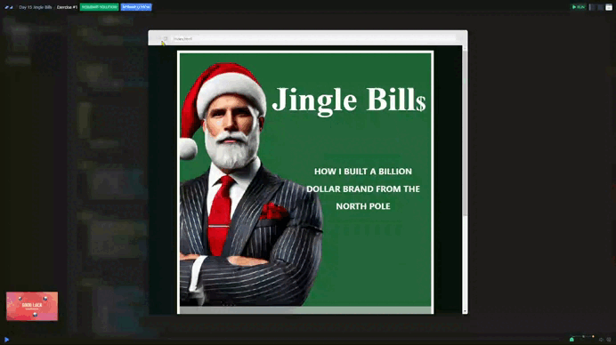

# Day 15 - Jingle Bills 📕

As a starting point, you are given an HTML file with unstyled content and a CSS file where a green color variable is already defined.

## Challenge

+ Apply the necessary styles in the CSS file to match the final design.

## Solution

| [Scrim code](https://scrimba.com/exercise-s05hjof3jh) |
| --- |

---
[🔙 Javascriptmas 2024](../README.md)