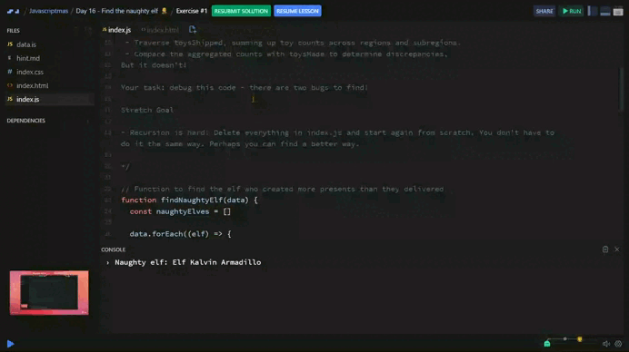

# Day 16 - Find the naughty elf 🧝

## Challenge

Santa has grown suspicious that one of his elves isn't playing fair. The elves are paid well to make toys but Santa thinks one of the elves is keeping some of the toys he has made (and probably selling them on the black market in one of Laplands dodgier neighbourhoods.)

Santa has written a script to recursively look over the data and find discrepancies. But Santa is not so great at coding and he has got bugs he can't resolve.

This code should:
 - Traverse through all elves.
 - Traverse toysShipped, summing up toy counts across regions and subregions.
 - Compare the aggregated counts with toysMade to determine discrepancies.
But it doesn't!

Your task: debug this code - there are two bugs to find! 

***Stretch Goal***

- Recursion is hard! Delete everything in index.js and start again from scratch. You don't have to do it the same way. Perhaps you can find a better way.

## Solution

| [Scrim code](https://scrimba.com/exercise-s0bekaf847) |
| --- |



### *Recursive function to sum shipped toys*

```js
function sumToys(shipmentData) {
  for (const region in shipmentData) {
    const subRegion = shipmentData[region];
    if (Array.isArray(subRegion)) {
      subRegion.forEach(({ toy, count }) => {
        totalShipped[toy] = (totalShipped[toy] || 0) + count
      })
    } else {
      sumToys(subRegion) /* 👈 */
    }
  }
}
```

+ ***Purpose:*** Process the hierarchical structure of toysShipped (which may contain regions and subregions) and sum the toys shipped by type.
+ ***Functionality:***
  + A `for...in` loop is used to traverse each level of the hierarchy.
  + If the value is an array (`Array.isArray`):
    + It is a list of shipped toys. Each object contains:
      + `toy`: The name of the toy.
      + `count`: The quantity shipped.
    + The `count` is added to the `totalShipped` object, accumulating totals by toy type.
  + If the value is another object:
    + It is a subregion. The function calls itself recursively to process it.

### *Calculate shipped toys*

```js
sumToys(elf.toysShipped);
```

+ ***Purpose:*** This line invokes the `sumToys` function to calculate the total number of toys shipped for the current elf.
+ ***Functionality:***
  + It processes the `toysShipped` data structure of the elf, which may contain nested regions and toy shipment details.
  + The `totalShipped` object is populated with the accumulated number of toys shipped, categorized by toy type.


  ---
[🔙 Javascriptmas 2024](../README.md)