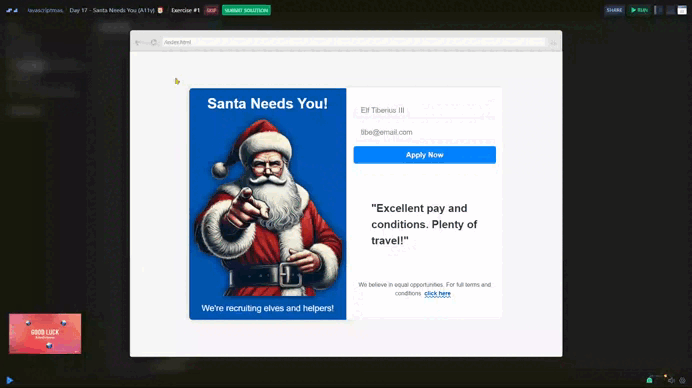

# Day 17 - Santa Needs You (A11y) 🎅

Santa needs extra help in the run up to Christmas so he has created this advert with a form to allow elves and helpers to sign up.

In the small print, it says “we believe in equal opportunities”. But there is no evidence of that in this website because it has a ton of accessibility issues!

## Challenge

Your task is to find and correct the accessibility issues. There are broadly four areas to think about. I have put details in hint.md but why not try to solve the issues without checking hint.md first!

You will need to change code in index.html and index.css to complete this challenge.

## Solution

| [Scrim code](https://scrimba.com/exercise-s0p72bnju9) |
| --- |

---
[🔙 Javascriptmas 2024](../README.md)