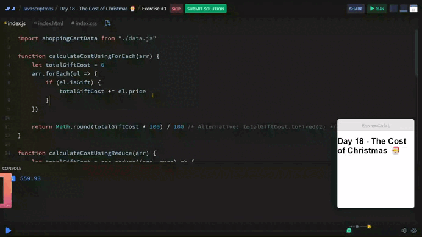

# Day 18 - The Cost of Christmas 🎅

## Challenge

😱 Christmas can get expensive! 

You've been on a shopping trip and spent too much money. 
But how much of that can you blame on Christmas?

***Task***

- Calculate and return the total cost of only the gifts in the shopping cart.
- Each gift has the isGift boolean set to true.
- The total cost of gifts should be given to two decimal places.

Expected output: 559.93  

***Stretch Goal***

- Use the reduce() method to complete this challenge.


## Solution

| [Srim code](https://scrimba.com/exercise-s07p4b787m) |
| --- |



```js
function calculateCostUsingForEach(arr) {
    let totalGiftCost = 0
    arr.forEach(el => {
        if (el.isGift) {
            totalGiftCost += el.price
        }
    })
    // totalGiftCost.toFixed(2)
    return Math.round(totalGiftCost * 100) / 100
}

function calculateCostUsingReduce(arr) {
    let totalGiftCost = arr.reduce((acc, curr) => {
        if (curr.isGift) {
            return acc + curr.price
        }
        return acc
    }, 0)
    return Math.round(totalGiftCost * 100) / 100
}
```


---
[🔙 Javascriptmas 2024](../README.md)