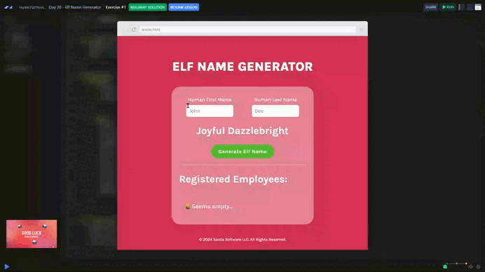

# Day 20 - Elf Name Generator 🧝

## Challenge

- Generate an elf first and last name that matches the user’s first and last name initials, then display it on the screen.
- Example: if the user’s name is "John Doe," the elf name could be "Joyful Dazzle."
- Display the generated elf names in the "Registered Employees" list.

***Stretch Goals*** 🌟
- Generate the elf names using an LLM API (like HuggingFace). 
- Don't save the same name twice. (not necessary for the normal task)
- Make sure to use Scrimba's environment variables feature so you don't expose your API key 

## Solution

| [Srim code](https://scrimba.com/exercise-s04jgjc6t5) |
| --- |

---
[🔙 Javascriptmas 2024](../README.md)