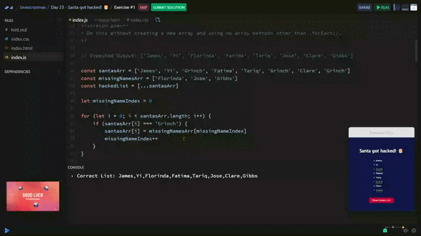

# Day 23 - Santa got hacked! 🎅

Santa has been hacked! In the list of kids to deliver to, the Grinch has replaced some kids' names with his own name.

The original array looked like this:
```js
['James', 'Yi', 'Florinda', 'Fatima', 'Tariq', 'Jose', 'Clare', 'Gibbs']
```

***Task*** 
+ Remove 'Grinch' from santasArr and put the missing kids back in their original places!

***Stretch goal***
- Do this without creating a new array and using no array methods other than .forEach().

## Solution

| [Srim code](https://scrimba.com/exercise-s08khm4ch0) |
| --- |




---
[🔙 Javascriptmas 2024](../README.md)